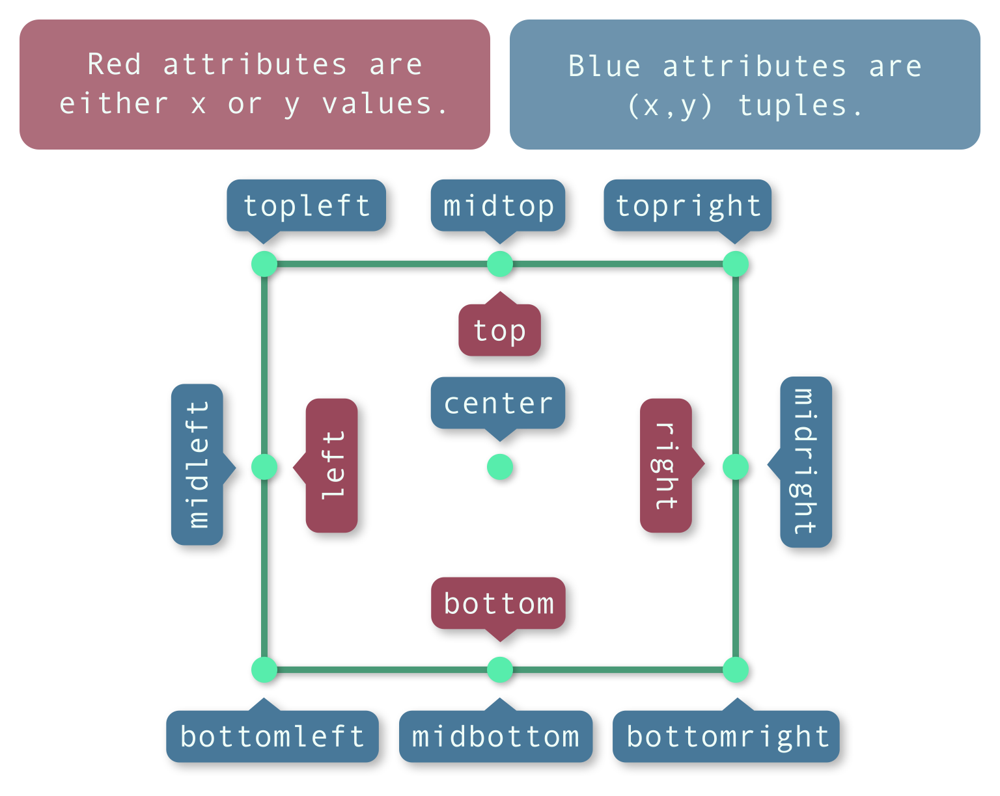

Rect
====

.. warning::

    This class may undergo changes in the near future.

Description
-----------

The **Rect** class represents a rectangle in 2D space. It is defined by its top-left corner and its size.
Its most common uses are source and destination rectangles in blitting operations, as well as collision detection.

It may be undocumented, but there are methods for all 9 anchor points and 4 sides of the rectangle, as shown below:

Usage
-----

.. code-block:: cpp

    // Instantiate a Rect.
    kn::Rect rectA = {50, 50, 16, 16};

    // Instantiate another Rect.
    kn::Rect rectB = {100, 100, 12, 12};

    // Check if they collide.
    if (rectA.collideRect(rectB)) {
        // Handle collision
    }

    // Move the center of rectA to the center of the window
    rectA.center(kn::window::getSize() / 2.0);

    // Move the top left of rectB to the bottom right of rectA
    rectB.topLeft(rectA.bottomRight());

    // Clamp rectA inside rectB
    rectA.clamp(rectB);

Members
-------

.. doxygenstruct:: kn::Rect
    :members:
